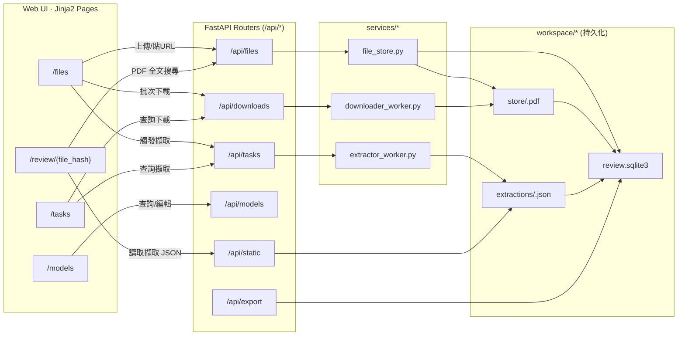

# Datasheet Proofing

以 **FastAPI + Jinja2** 打造的**資料表（datasheet）校對系統**：支援上傳/下載 PDF、呼叫 OpenAI 進行規格擷取、在瀏覽器端校對與匯出結果。  
本文件為**長期維護**所寫，假設讀者**不曾參與開發**，照做即可把系統跑起來、理解資料流、並定位常見問題。

---

## 系統資料流（總覽）

> 供維護者快速建立心智模型。支援 GitHub/Markdown 的 Mermaid 圖示；若無法渲染，請將下列區塊貼到支援 Mermaid 的環境檢視。



---

## 目錄
- [系統需求](#系統需求)
- [快速開始（TL;DR）](#快速開始tldr)
- [安裝與環境變數](#安裝與環境變數)
- [專案結構與資料儲存](#專案結構與資料儲存)
- [啟動與停止（Windows/跨平台）](#啟動與停止windows跨平台)
- [Web UI 導覽](#web-ui-導覽)
- [API 一覽與範例](#api-一覽與範例)
- [資料流與元件關係](#資料流與元件關係)
- [疑難排解（FAQ）](#疑難排解faq)
- [維護者指南](#維護者指南)
- [版本與相容性](#版本與相容性)
- [安全注意事項](#安全注意事項)
- [變更摘要（相對舊版 README）](#變更摘要相對舊版-readme)

---

## 系統需求
- Python **3.10+**（建議 3.11）
- OS：Windows 10/11（附 PowerShell 腳本）、macOS、Linux 皆可
- 不需 GPU
- 可連外網以呼叫 OpenAI API（若要使用擷取功能）

---

## 快速開始（TL;DR）

```bash
# 1) 建置虛擬環境並啟用
python -m venv venv
# Windows:
venv\Scripts\Activate.ps1
# macOS/Linux:
source venv/bin/activate

# 2) 安裝依賴
pip install -r requirements.txt

# 3) 建 .env（至少要有 OPENAI_API_KEY 才能做擷取）
#   WINDOWS: Notepad .env
#   MAC/LINUX: nano .env
# 內容示例見下節「安裝與環境變數」

# 4) 啟動（跨平台）
python -m uvicorn backend.app.main:app --host 127.0.0.1 --port 8000 --log-level debug
# 瀏覽器開 http://127.0.0.1:8000
```

**Windows 一鍵版（含防睡眠/自動開瀏覽器/寫入 PID 與 log）**  
```powershell
.\script\run.ps1    # 啟動
.\script\shutdown.ps1  # 停止並恢復系統睡眠
```

---

## 安裝與環境變數

專案使用 `pydantic` 設定。請在專案根目錄建立 `.env` 檔：

| 變數 | 是否必填 | 預設值 | 說明 |
|---|---:|---|---|
| `OPENAI_API_KEY` | 必填（擷取功能） | — | OpenAI API 金鑰。未提供則仍可上傳/下載/瀏覽 PDF，但**無法做規格擷取**。 |
| `HOST` | 選填 | `127.0.0.1` | 服務綁定位址（只影響程式內部讀值；用 `uvicorn` 指令時以指令旗標為準） |
| `PORT` | 選填 | `8000` | 同上 |
| `DEBUG` | 選填 | `true` | FastAPI/應用邏輯內的除錯開關 |
| `DEBUG_DEVTOOLS` | 選填 | `false` | 若開啟，啟動時可能載入開發者工具；預設請關閉 |

> 註：實際可用鍵值以 `backend/app/settings.py` 為準；上表列出最影響啟動與擷取流程者。

安裝依賴：
```bash
pip install -r requirements.txt
```

---

## 專案結構與資料儲存

```
backend/
  app/
    main.py                 # FastAPI 入口，掛載 Jinja2 模板與路由
    routers/                # 所有 REST API 分組
    templates/              # 前端頁面（Jinja2）
    static/                 # 前端靜態資源
services/
  downloader_worker.py      # 下載 PDF 的佇列/工作
  extractor_worker.py       # 呼叫 OpenAI 擷取規格的佇列/工作
  file_store.py             # PDF 與檔案中繼資料（FileAsset）存取
workspace/                  # 自動建立/持久化資料（見下）
script/
  run.ps1                   # Windows 一鍵啟動（防睡眠/背景常駐/自動開瀏覽器/寫 log）
  shutdown.ps1              # Windows 一鍵停止（依 PID 結束/恢復睡眠）
requirements.txt
```

**工作目錄（`workspace/`）** — 請備份此目錄；含系統狀態與輸出：
- `workspace/store/{file_hash}.pdf`：上傳/下載後的 PDF 實檔
- `workspace/extractions/{file_hash}.json`：擷取輸出（AI 結果）
- `workspace/review.sqlite3`：後端資料庫（SQLite，預設 WAL）

---

## 啟動與停止（Windows/跨平台）

### Windows（建議）
```powershell
.\script\run.ps1
# 內容包含：
# - 建立 venv、安裝 requirements（首次）
# - 設定防睡眠（不影響螢幕自動關閉）
# - 背景啟動 uvicorn（非緩衝輸出，stdout/stderr 寫入 log）
# - 記錄 PID 到 log/server.pid
# - 啟動成功自動打開 http://localhost:8000

.\script\shutdown.ps1
# 內容包含：
# - 依 PID 停止 uvicorn 主程序及子程序
# - 刪除 server.pid
# - 呼叫 Windows API 恢復預設睡眠行為
```

### macOS / Linux（或手動）
```bash
python -m uvicorn backend.app.main:app --host 127.0.0.1 --port 8000 --log-level debug
```

**日誌與 PID**
- `log/core_stdout.log`, `log/core_stderr.log`
- `log/server.pid`

---

## Web UI 導覽

| 路徑 | 用途 | 主要功能 |
|---|---|---|
| `/` | 入口 | 307 轉址至 `/files` |
| `/files` | 檔案管理 | 列表/分頁、上傳 PDF（多檔）、批次貼 URL 入列下載、觸發擷取、連至詳情與校對 |
| `/files/{file_hash}` | 檔案詳情 | 檔案中繼、是否已擷取、關聯型號列表、解除檔案×型號關聯 |
| `/review/{file_hash}` | 校對頁 | 左側 PDF 預覽＋全文搜尋；右側規格欄位可編輯（雙擊進入、Enter 儲存、Esc 取消）；可檢視 AI 依據 |
| `/models` | 型號管理 | 清單、搜尋、是否已驗證/是否有檔案過濾；規格編輯；標記已驗證（寫入 reviewer/時間） |
| `/tasks` | 佇列監控 | 下載任務／擷取任務狀態、篩選、重試下載（失敗） |
| `/pdf/{file_hash}` | PDF 直出 | 回傳 PDF，供瀏覽器或外部工具開啟 |

---

## API 一覽與範例

> 伺服器預設 `http://127.0.0.1:8000`。以下僅列要點與關鍵參數，實作詳見 `backend/app/routers/*`。

### 1) Files — `/api/files`
- `GET /api/files`：檔案列表  
  Query：`page`（default 1）、`page_size`（1~500，default 50）

- `GET /api/files/{file_hash}`：單檔資訊

- `GET /api/files/{file_hash}/search`：在 PDF 內搜尋字串（供 `/review/{file_hash}` 使用）  
  Query：`q`（必填）、`max_results`（1~200，default 20）、`context`（0~200，default 40）  
  回傳：`[{page, snippet, rects, page_size}, ...]`，其中 `rects` 與 `page_size` 用於前端高亮命中區塊。

- `POST /api/files/upload-multi`（multipart/form-data）：多檔上傳  
  範例：
  ```bash
  curl -F "files=@A.pdf" -F "files=@B.pdf" http://127.0.0.1:8000/api/files/upload-multi
  ```

- `POST /api/files/upload-urls`（form-data）：批次貼 URL 入列下載  
  欄位：`urls`（可用多筆欄位或一個欄位內以換行分隔）、可選 `hsd_name`  
  範例：
  ```bash
  curl -X POST -F "urls=https://example.com/a.pdf" -F "urls=https://example.com/b.pdf" -F "hsd_name=ACME" http://127.0.0.1:8000/api/files/upload-urls
  ```

- `GET /api/files/{file_hash}/models`：該檔案關聯的型號列表

- `DELETE /api/files/{file_hash}/models/{model_number}`：解除檔案×型號關聯  
  > **注意**：目前**沒有**「建立關聯」API；建立關聯來自擷取流程或更新型號資訊。

---

### 2) Downloads — `/api/downloads`
- `POST /api/downloads/enqueue`：批次將 URL 入列下載  
  Body（JSON）：`["https://.../a.pdf","https://.../b.pdf"]`；Query 可帶 `hsd_name`  
  範例：
  ```bash
  curl -X POST "http://127.0.0.1:8000/api/downloads/enqueue?hsd_name=ACME" -H "Content-Type: application/json" -d '["https://example.com/a.pdf","https://example.com/b.pdf"]'
  ```

- `GET /api/downloads`：下載任務列表  
  Query：`limit`（1~1000，預設 200）、`status`（`queued/running/success/failed`）

- `POST /api/downloads/{task_id}/retry`：重試下載

---

### 3) Tasks（擷取佇列）— `/api/tasks`
- `POST /api/tasks/queue`：將 `file_hashes` 入列進行擷取  
  Body（JSON）：
  ```json
  {
    "file_hashes": ["<sha256>", "..."],
    "force_rerun": false
  }
  ```
  回傳會清楚列出 `queued / skipped_existing / not_found / duplicates_ignored`。

- `GET /api/tasks/extraction`：擷取任務列表  
  Query：`limit`（預設 200）、`status`（`queued/submitted/running/succeeded/failed/canceled`）、`mode`（`sync/batch/background`）

- `GET /api/tasks/download`：下載任務列表（供 `/tasks` 頁）

---

### 4) Models — `/api/models`
- `GET /api/models`：型號列表  
  Query：`q`（模糊搜尋）、`status`（`verified/unverified`）、`has_files`（`true/false`）、`page`、`page_size`（1~200，預設 50）

- `GET /api/models/{model_number}`：單一型號詳情

- `PATCH /api/models/{model_number}`：部分更新（規格欄位／驗證狀態與 reviewer/時間／notes）  
  > 若修改任何規格欄位且原本為 `verified`，系統會自動改為 `unverified` 並清空 `reviewer / reviewed_at`；  
  > 若 PATCH 指定 `verify_status=verified`，後端會寫入 reviewer 與 reviewed_at（以伺服器時間為準）。

- `DELETE /api/models/{model_number}`：刪除整個型號（含應用標籤與檔案關聯，依外鍵級聯）

---

### 5) Export — `/api/export`
- `GET /api/export`：全庫匯出  
  Query：`status`（可選）、`fmt`（`json`/`csv`/`xlsx`）

- `POST /api/export/by-models`：依**指定型號清單**匯出  
  Body（JSON）：
  ```json
  {
    "model_numbers": ["ABC-123","XYZ-999"],
    "status": "verified",
    "fmt": "csv",
    "preserve_order": true
  }
  ```
  `fmt`：`json`/`csv`/`xlsx`；`preserve_order=true` 會照 `model_numbers` 原順序輸出。

- `POST /api/export/model-settings`：輸出「型號清單模板」（供 Excel 填寫後再轉換成其他專案的 JSON Schema）  
  Body（JSON）：
  ```json
  {
    "model_numbers": ["ABC-123","XYZ-999"],
    "fmt": "xlsx",
    "preserve_order": true
  }
  ```
  `fmt`：`csv`/`xlsx`

---

### 6) Static Proxy — `/api/static`
- `GET /api/static?path=...`：以白名單代理回傳 JSON 檔  
  安全限制：**僅允許** `workspace/extractions/`（以及預留的 `workspace/exports/`）下的檔案

---

## 資料流與元件關係

1. **檔案進來**  
   - 使用者上傳 PDF（`/api/files/upload-multi`），或貼 URL 入列下載（`/api/files/upload-urls` → `/api/downloads/enqueue`）。  
   - 下載 worker 寫入 `workspace/store/{file_hash}.pdf`，並建立/更新 `FileAsset` 紀錄。

2. **觸發擷取**  
   - 使用者在 `/files` 或 `/review/{file_hash}` 觸發擷取（`/api/tasks/queue`）。  
   - extractor worker 呼叫 OpenAI，將輸出寫入 `workspace/extractions/{file_hash}.json`，並據此更新/建立 Model 記錄及其欄位。

3. **校對與驗證**  
   - 於 `/review/{file_hash}` 編輯欄位、在 `/models` 管理與驗證。  
   - 若更動已驗證資料，系統自動轉為未驗證，避免誤信舊標記。

4. **匯出**  
   - 以 `/api/export` / `/api/export/by-models` 取得 JSON/CSV/XLSX。  
   - 以 `/api/export/model-settings` 取得「型號清單模板」（CSV/XLSX）。  
   - 可用 `/api/static` 代理讀取白名單內的 JSON 檔案。

---

## 疑難排解（FAQ）

- **擷取無法執行**：確認 `.env` 已設定 `OPENAI_API_KEY`（且金鑰有效）。  
- **連不到首頁**：請使用 `http://127.0.0.1:8000`（或以 `.env`／啟動參數的 HOST/PORT 為準）。  
- **檔案上傳成功但沒擷取結果**：到 `/tasks` 看擷取任務狀態；完成後會在 `workspace/extractions/{file_hash}.json` 出現輸出。  
- **SQLite 檔被鎖住**：確認沒有重複啟動；Windows 用 `shutdown.ps1` 正常停止，避免殘留程序。  
- **Windows 自動睡眠導致服務中斷**：使用 `.\script\run.ps1` 啟動；停止請用 `.\script\shutdown.ps1` 以恢復睡眠設定。  
- **大量匯出變慢**：優先使用 `POST /api/export/by-models` 並提供精確清單；如要全庫 CSV，請預留時間並避免同時大量擷取。  

---

## 維護者指南

- **程式入口**：`backend/app/main.py`。新增功能請在 `backend/app/routers/` 建新檔再掛到 `main.py`。  
- **下載/擷取邏輯**：在 `services/` 目錄；若要切換模型或服務等級（service tier），先由此處下手。  
- **工作目錄**：`workspace/` 是**唯一需要持久化/備份**的資料根目錄。  
- **依賴更新**：修改 `requirements.txt` 後請在本機重新安裝並走一遍 `/files → /tasks → /review → /export` 的回歸路徑。  
- **例外處理與日誌**：預設 stdout/stderr 會寫入 `log/core_*.log`；Windows 走 `run.ps1` 後更容易定位錯誤。  
- **安全邊界**：`/api/static` 僅允許工作區白名單路徑；若新增代理功能務必維持白名單策略。  
- **驗證機制**：PATCH 若改動已驗證模型的任一欄位，系統會自動取消驗證；請在 UI 流程中提示 reviewer 再次確認。  

---

## 版本與相容性
- Python：**3.10+**（建議 3.12.1）  
- 資料庫：SQLite（WAL）  
- 若資料結構調整（例如新增欄位），請提供**一次性遷移腳本**或在啟動時偵測並自動遷移。

---

## 安全注意事項
- **API 金鑰**：`OPENAI_API_KEY` 僅存於 `.env`；請勿提交到版本庫。  
- **檔案代理**：`/api/static` 嚴格白名單；不得放寬至任意路徑或可執行檔型。  
- **使用者上傳**：僅接受 PDF；若要擴充其他格式，務必補齊 MIME/type 檢查與掃描策略。  

---

## 變更摘要（相對舊版 README）
- 用**中文（台灣用語）**重寫，完整覆蓋「安裝、環境、啟停、UI 導覽、API、資料流、維護、疑難排解、安全」等維護向主題。  
- 明確指出**不存在**的端點（例如「建立檔案×型號關聯」）避免踩雷，並標注替代流程。  
- 新增 **Windows 一鍵腳本行為說明**（防睡眠／恢復睡眠、PID、log、瀏覽器自動開啟）與**工作目錄備份**重點。  
- 將擷取/下載任務的**狀態集合**分別列出，對齊實作（`queued/running/success/failed` vs `queued/submitted/running/succeeded/failed/canceled`）。  
- 提供可直接執行的 `curl` 範例與最小啟動命令；對新同事**可操作**而非僅描述。  

### 自 `b9ed70c4` 以來的功能更新
- 移除 `/api/extractions`：改以 `/api/static` 直接讀取 `workspace/extractions/{file_hash}.json`（流程較不易受內部任務/儲存格式調整影響）。
- `/review/{file_hash}` PDF 全文搜尋：`GET /api/files/{file_hash}/search` 回傳命中頁碼＋snippet＋矩形座標，前端可高亮顯示命中區塊。
- OpenAI 成本計算：支援版本化 model 名稱（如 `gpt-5-YYYY-MM-DD`）做定價歸一化，避免 token 有值但 cost 永遠為 0。
- 匯出升級：規格匯出支援 `xlsx`；新增 `POST /api/export/model-settings` 輸出「型號清單模板」（CSV/XLSX），供 Excel 補 HSD 等欄位後再轉換進一步處理。
